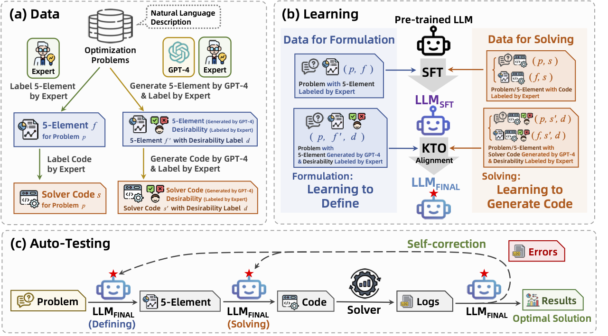

# LLMOPT: Learning to Define and Solve General Optimization Problems from Scratch

This repository contains the code for LLMOPT, enabling the reproduction of data generation, model learning, and automated testing as described in the accompanying paper. The running shell are in the `script` folder with the deepspeed training config in `config`.

## 🔥News
- [2025/01/22]: Our paper "LLMOPT: Learning to Define and Solve General Optimization Problems from Scratch" accepted by ICLR2025!!! 🔥.
- [2024/09/30]: We firstly release our training and test code, as well as data generation code for LLMOPT.

## Overview


- In this paper, we present LLMOPT, a learning-based framework designed to tackle the challenges of optimization generalization in current LLM-based methods. To enhance the generalization of our approach, we first introduce a learning-to-define module that constructs a five-element formulation as a universal framework for various optimization types. To improve performance, we employ multi-instruction fine-tuning and model alignment for both problem formulation and solver code generation. Finally, we incorporate a self-correction mechanism to further enhance system performance during testing. Under an extensive and realistic experimental setting, LLMOPT demonstrates significantly superior performance compared to all competitors.

## Usage
### Requirements
Necessary python libraries and versions are in the `requirements.txt`:
```bash
pip install -r requirements.txt
```
with `python>=3.6`. 

### Installation
For development, you can clone the repository and install it locally.
```bash
git clone https://anonymous.4open.science/r/LLMOPT
cd LLMOPT
```

### User Case 1: SFT training

The hyperparameter setting and method for our Multi-Instruction Supervised Fine-Tuning(MISFT):
```bash
torchrun $DISTRIBUTED_ARGS ../sft/sft.py \
    --model_name_or_path $MODEL \
    --data_path $DATA \
    --bf16 True \
    --output_dir "./output_dir" \
    --num_train_epochs 1000 \
    --per_device_train_batch_size 4 \
    --per_device_eval_batch_size 1 \
    --gradient_accumulation_steps 8 \
    --evaluation_strategy "no" \
    --save_strategy "steps" \
    --save_steps 100 \
    --save_total_limit 1 \
    --learning_rate 3e-4 \
    --weight_decay 0.01 \
    --adam_beta2 0.95 \
    --warmup_ratio 0.01 \
    --lr_scheduler_type "cosine" \
    --logging_dir ./logs_v0 \
    --logging_strategy "steps"\
    --logging_steps 1 \
    --report_to "tensorboard" \
    --model_max_length 1500 \
    --lazy_preprocess True \
    --use_lora ${USE_LORA} \
    --q_lora ${Q_LORA} \
    --gradient_checkpointing \
    --save_only_model \
    --deepspeed ${DS_CONFIG_PATH}
```
The complete MISFT code can be found in `./script/run_sft.sh`, just run the following command:
```bash
bash run_sft.sh
```

### User Case 2: KTO Training

The hyperparameter setting and method for KTO training is as follows:
```bash
torchrun $DISTRIBUTED_ARGS ../kto/kto.py \
    --deepspeed ${DS_CONFIG_PATH} \
    --per_device_train_batch_size 4 \
    --num_train_epochs 100 \
    --evaluation_strategy "no" \
    --learning_rate 1e-4 \
    --lr_scheduler_type=cosine \
    --per_device_eval_batch_size 1 \
    --gradient_accumulation_steps 8 \
    --save_steps 100 \
    --save_total_limit 1 \
    --logging_dir ./logs_v0 \
    --logging_strategy "steps"\
    --logging_steps 10 \
    --warmup_ratio 0.1 \
    --weight_decay 0.01 \
    --adam_beta2 0.95 \
    --report_to "tensorboard" \
    --bf16 \
    --logging_first_step \
    --use_peft \
    --lora_target_modules=all-linear \
    --lora_r=16 \
    --lora_alpha=16 \
    --save_only_model \
    --output_dir "./output_dir"
```
The complete KTO code can be found in `./script/run_kto.sh`, just run the following command:
```bash
bash run_kto.sh
```
## Inference
The following example code for model inference in getting the experiement data:
```python
model = AutoModelForCausalLM.from_pretrained(path,torch_dtype="auto",device_map="auto")
tokenizer = AutoTokenizer.from_pretrained(path_t)
prompt = "Give me a short introduction to large language model."
messages = [{"role": "system", "content": "You are a helpful assistant."},
            {"role": "user", "content": prompt}
            ]
text = tokenizer.apply_chat_template(
    messages,
    tokenize=False,
    add_generation_prompt=True
)
model_inputs = tokenizer([text], return_tensors="pt").to(device)
generated_ids = model.generate(model_inputs.input_ids,max_new_tokens=512)
generated_ids = [output_ids[len(input_ids):] for input_ids, output_ids in zip(model_inputs.input_ids generated_ids)]
response = tokenizer.batch_decode(generated_ids, skip_special_tokens=True)[0]
print(response)
```

## Data Release
Our testing data is released in the `data` folder, and the training example can be found in `data/trainset_example` folder including MISFT and KTO stage. Our full training data will be coming soon ...

## Model Release
Our post-trained model will be coming soon on huggingface ...

## Citation 
If you encounter any question about our work, please do not hesitate to submit an issue. If you do find our resources helpful, please cite our paper.

```
@inproceedings{JiangShu2025llmopt,
  title     = {LLMOPT: Learning to Define and Solve General Optimization Problems from Scratch},
  author    = {Caigao Jiang and Xiang Shu and Hong Qian and Xingyu Lu and Jun Zhou and Aimin Zhou and Yang Yu},
  booktitle = {Proceedings of the Thirteenth International Conference on Learning Representations (ICLR)},
  year      = {2025},
  address   = {Singapore, Singapore},
  url       = {https://openreview.net/pdf?id=9OMvtboTJg}
}
```

